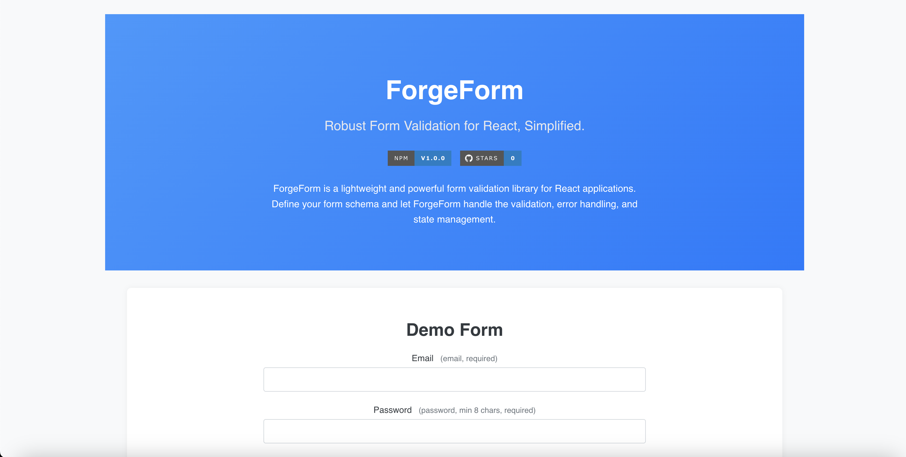

# ForgeForm



**Lightweight, TypeScript-First Form Validation for Modern Web Applications**

ForgeForm is a powerful and intuitive form validation library built with TypeScript for robust web application development. It simplifies form validation with its declarative schema definition, comprehensive validation engine, React hook for easy form state management, and a rich regex builder.

## Features

*   **Intuitive DSL (Domain Specific Language):**
    *   Define form schemas effortlessly using `createSchema` with a clean, JSON-like syntax.
    *   Supports a wide range of field types: `string`, `number`, `boolean`, `email`, `url`, and more.
    *   Handles complex data structures including nested `objects` and `arrays`.
    *   Offers advanced type support: `union`, `literal`, `tuple`, and `record` types.

*   **Robust Core Validation Engine:**
    *   **Type-Safe Validation:** Ensures data adheres to the expected types defined in your schema.
    *   **Built-in Sanitization:** Automatically sanitizes string inputs by trimming whitespace and converting case (lowercase or uppercase) based on your schema configuration.
    *   **Regex/Format Validation:** Leverages a comprehensive regex builder with over 50 RCN (Reusable, Community-Driven, and Node.js-friendly) compliant regex patterns for robust format validation.
    *   **Custom Validators:**  Easily extend validation logic with synchronous or asynchronous custom validators to handle complex business rules.
    *   **Customizable Error Messages:**  Define tailored error messages and error codes for each validation rule, enhancing user feedback and application localization.

*   **React Hook (`useForm`):**
    *   Simplifies form state management in React applications.
    *   Manages form data and validation errors seamlessly.
    *   Handles nested form fields effortlessly using dot-notation in field names (e.g., `"address.street"`).
    *   Provides real-time validation feedback to users, improving form usability.

*   **Comprehensive Regex Builder:**
    *   Includes a vast collection of over 50 pre-built, RCN-compliant regex patterns.
    *   Covers common data formats like `email`, `phone`, `url`, `uuid`, `zip`, `ip`, `date`, `time`, `creditCard`, `color`, and many more.
    *   Offers complex validation patterns for scenarios like semantic versioning, social media handles, and various postal code formats.
    *   Allows for custom regex creation using the `buildRegex` function, providing flexibility for specific validation needs.

*   **Extensibility & Customization:**
    *   Designed for extensibility, allowing you to easily extend or override built-in validators, sanitizers, and regex patterns to match your application's specific requirements.

## Installation

Install ForgeForm using npm or yarn:

```bash
npm install forgeform
```
```bash
yarn add forgeform
```